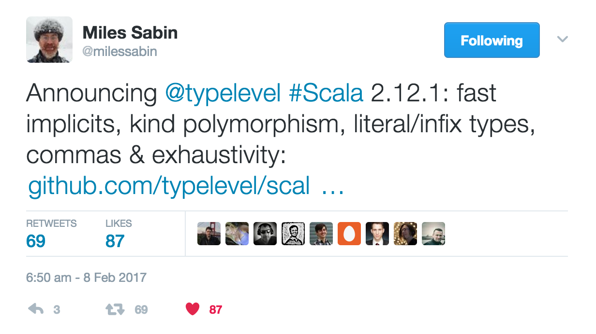

#Playing with Typelevel Programming
Some while ago I came across **Typelevel Programming** and I wanted to know more about it. I tried to dig deeper in the subject and I found a number of interesting articles dealing with the topic:

* [Type-Level Programming in Scala](https://apocalisp.wordpress.com/2010/06/08/type-level-programming-in-scala/) 
* [Type Level Programming in Scala step by step](http://gigiigig.github.io/tlp-step-by-step/introduction.html)

I especially enjoyed the second one since it covered more concepts from the area with easily understandable examples. This was the first time I had an **AHHHAAAA!!** feeling with the [Aux pattern](http://gigiigig.github.io/posts/2015/09/13/aux-pattern.html)

Meanwhile I was exploring the subject I felt like more and more trace leads back to [Shapeless](https://github.com/milessabin/shapeless) which is a Generic Programming library for Scala. Despite the fact that is has a fairly good [documentation](https://github.com/milessabin/shapeless/wiki/Feature-overview:-shapeless-2.0.0) I was still struggling to put into practice what I read and learnt there. 

Then a game changer book was published by Dave Gurnell and Underscore about Shapeless: [The Type Astronaut's Guide to Shapeless Book](http://underscore.io/books/shapeless-guide/)  

This was the second time I had **AHHHAAAA!** feeling and step by step I started to feel that this is something I might be able to use even in my daily job confidently - assuming my team mates are not commiting suicide immediately after seeing my PR.

Armed with my new book/knowledge I started to think about a potential pet project what I can use to sink my teeth into the topic more. One of my colleagues - Tomek - suggested me to play with the [machine readable travel documents format](https://en.wikipedia.org/wiki/Machine-readable_passport) and try to write a parser for it. It seemed to be a brilliant idea. I literally spent days and nights to come up with a reasonable solution. It gave me good opportunity to pull in [Cats](http://typelevel.org/cats/) as well to start get used to it in this post scalaz world. 
 
My solution was nearly ready but one feature was missing. I wanted to use *hlist.Intersection* to remove items from my generic representation before it is converted to the final case class. The modification was a minor change but the impact was tremendous. My test class didn't seem to compile. I mean **there wasn't any error from the compiler but instead it was compiling the test class for hours turning my Mac to central heating system**... I was experimenting with the solution and the number of fields in the target case class and it turned out that every additional field roughly doubles the compile time. *By the time I had 5 fields it was already 9-10 minutes!! And I needed 11 fields*... Good luck! 

I was very dissappointed. Then I was attending [Miles's presentation](https://skillsmatter.com/skillscasts/9043-typelevel-scala-rebooted) at the ScalaX 2016 and I saw the light at the end of the tunnel. I didn't know that time if it was really the end of the tunnel or just a fast train runnig towards me. I thought that instead of using Lightbend Scala may be I have to give a try to Typelevel Scala. It ment to contain some fixes and improvements on top of Lightbend Scala. 
Unfortunately it couldn't solve the issue. For the real break through I had to wait till last week. 



I had high expectations against Typelevel Scala 2.12.1 fast implicit resolution. I felt that this time it will be different! And it turned out that it helped a lot. **The compilation time droped from ~6hours to 3 minutes although the cpu still behaves like a heater** :)

So now I have riched the point where I can publish my MRD solution based on Shapless. 

##Custom Typesafe MRD parser
Typesafe parser of the data encoded on machine readable passport.

The format of data available on machine readable travel documents is
available on Wikipedia. 

The library allows to define different formats of documents encoded 
using ICAO 9303 standard (passports/identity cards/others) and to define
parsers that parse these documents into case classes in typesafe manner.

Sample code:
```scala
val sampleData =
      """P<HUNLACHATA<<KRISZTIAN<<<<<<<<<<<<<<<<<<<<<
        |HG45654029HUN7906075M2508201<<<<<<<<<<<<<<04""".stripMargin
    
case class PassportMetadata(documentType: String,
                              documentSubtype: String,
                              country: String,
                              surname: String,
                              passportNumber: String,
                              nationality: String,
                              dateOfBirth: LocalDate,
                              sex: Sex,
                              expirationDate: LocalDate,
                              personalNumber: String,
                              checksum: String)
    
val passportFormat =
    'documentType ->> StringField(1) ::
    'documentSubtype ->> StringField(1) ::
    'country ->> StringField(3) ::
    'surname ->> StringField(39) ::
    'passportNumber ->> StringField(10, checksum = true) ::
    'nationality ->> StringField(3) ::
    'dateOfBirth ->> DateField ::
    'sex ->> SexField ::
    'expirationDate ->> DateField ::
    'personalNumber ->> StringField(15, checksum = true) ::
    'checksum ->> StringField(1) :: HNil
    
println(sampleData.parseTo[PassportMetadata](passportFormat))
```    

###Usage
1. **Define your case class** what serves as a target container for the parser. In this case it is *PassportMetadata*
2. Use **predefined field parsers** to define your MRD format by **creating an HList containing parsers in the proper document field order**. Tag parsers based on its target field name in the case class:

	* **StringField** which can extract an arbitrary long string from an MRD document
	* **DateField** which can be used to extract dates
	* **SexField** which can extract gender

3. Run the parser against a given string

Please note that **you can have less field in your target case class than parser in your MRD format HList**. If a tag doesn't have a field in the case class that it will be dropped. 
Please also note that **the case class field order doesn't matter as long as the field name and the parser tag is in align**!!

#Custom Typesafe MRD parser vs Scodec MRD encoder
Recently I started to play with [scodec](https://github.com/scodec/scodec) in my other pet project. After I saw my parser working with 2.12.1 Typelevel compiler I thought it would be cool to implement the same MRD parser with scodec as well to see how my solution works compared to a mature binary parser scala library and vica versa. 

**Bear in mind that there is more than likely a better and nicer solutions for both of the implementations. If you have suggestions how I could improve them feel free to share!**
 
##Scodec MRD encoder
Sample code:
```scala
      """P<HUNLACHATA<<KRISZTIAN<<<<<<<<<<<<<<<<<<<<<
        |HG45654029HUN7906075M2508201<<<<<<<<<<<<<<04""".stripMargin
    
case class PassportMetadata(documentType: String,
                              documentSubtype: String,
                              country: String,
                              surname: String,
                              passportNumber: String,
                              nationality: String,
                              dateOfBirth: LocalDate,
                              sex: Sex,
                              expirationDate: LocalDate,
                              personalNumber: String,
                              checksum: String)
                              
  val passportMetadataCodec: Codec[PassportMetadata] = (
    ("documentType" | StringCodec(1)) ::
      ("documentSubtype" | StringCodec(1)) ::
      ("country" | StringCodec(3)) ::
      ("surname" | StringCodec(39)) ::
      ("passportNumber" | checksummed(StringCodec(9), checkSumFunction, bits(72) ~ bits(8))) ::
      ("nationality" | StringCodec(3)) ::
      ("dateOfBirth" | checksummed(LocalDateCodec, checkSumFunction, bits(48) ~ bits(8))) ::
      ("sex" | SexCodec) ::
      ("expirationDate" | checksummed(LocalDateCodec, checkSumFunction, bits(48) ~ bits(8))) ::
      ("personalNumber" | checksummed(StringCodec(14), checkSumFunction, bits(112) ~ bits(8))) ::
      ("checksum" | StringCodec(1))
    ).as[PassportMetadata]
    
    passportMetadataCodec.decode(BitVector(sampleData.filterNot(_.isWhitespace).getBytes()))
```
###Usage
1. **Define your case class** what serves as a target container for the parser. In this case it is *PassportMetadata*
2. Use **predefined scodec encoders/combinators** to define your MRD format.
3. Run the encoder against a given string

Please note that **you can have less field in your target case class than encoder if you use Unit encoders like ignore**. Adding name to the encoder is not directly binding the encoded value to a case class field. It is just for helping the user in case of encoding error.  
Please also note that **the case class field order does matter**!!

##Conclusion
Apart from my core parser implementation both solutions have roughly the same size of domain related code:
* [Shapeless](src/main/scala/org/kaloz/mrd/mrdshapeless)
* [Scodec](src/main/scala/org/kaloz/mrd/mrdscodec)

###Custom solution
* My solution **has just a handful of parsers**
* **Harder to extend and less generic**
* However my solution **supports arbitrary case class field ordering** as long as the parser tag has the same name! 
* **case class may have less fields than parsers** in your MRD format HList. If a parser tag doesn't exists in the case class field name list it will be just simple removed. 

###Scodec solution
* **Loads of different combinators** to deal with data encoding. I really like the **checksummed** encoder. It is really easy and convenient to use
* **Easily extendable**
* It would be amazing to use encoder names to bind the encoded value to the case class field via name. With this solution we could have arbitrary case class field orders! 